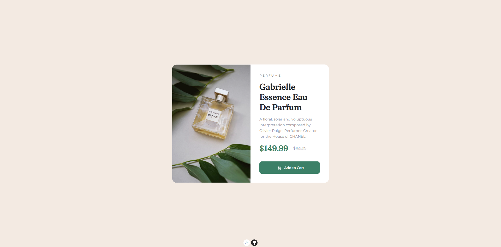
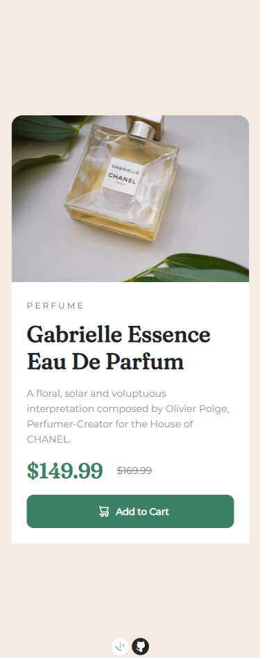

# Frontend Mentor - Product preview card component solution

This is a solution to the [Product preview card component challenge on Frontend Mentor](https://www.frontendmentor.io/challenges/product-preview-card-component-GO7UmttRfa). Frontend Mentor challenges help you improve your coding skills by building realistic projects. 

## Table of contents

- [Overview](#overview)
  - [The challenge](#the-challenge)
  - [Screenshot](#screenshot)
  - [Links](#links)
- [My process](#my-process)
  - [Built with](#built-with)
  - [What I learned](#what-i-learned)
  - [Continued development](#continued-development)

## Overview

### The challenge

Users should be able to:

- View the optimal layout depending on their device's screen size
- See hover and focus states for interactive elements

### Screenshot

### Links

- Solution URL: [https://github.com/MoggStephen/product-preview-card-component-main]
- Live Site URL: [https://moggstephen.github.io/product-preview-card-component-main/]

## My process

- Firstly set up the HTML
- I set up sass using a live compiler extension
- I set up the variables for certain colors and sizes using the designs
- Set up the elements flexboxes so that changing to desktop changes the elements appropriately
- Style the mobile version
- Style the desktop version

### Built with

- Semantic HTML5 markup
- Flexbox
- Transform
- Mobile-first workflow
- Sass.
- Hyphen delimited string class naming

### What I learned

- Used sass nesting and variables to develop the css.. Also learnt how sass comments and amperands for pseudoclasses work.
- Looked into google api for fonts and learnt that just importing the font doesnt import all the styles for the font!
- Learnt content css property
- I changed from camelcase to hyphen delimited string class naming as this is an industry standard!

### Continued development

- Continue working with sass.
- Continue class naming convention.